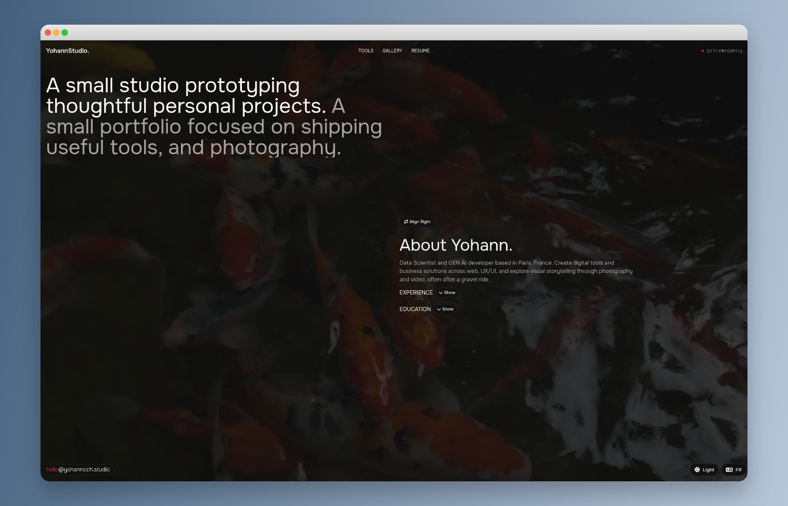

# YohannStudio

> 🚧 **Under Construction** — This project is actively being developed. Features may be incomplete or change without notice.

[](https://yohanncch.studio/)
[](https://vuejs.org/)
[](https://tailwindcss.com/)

A modern, minimalist personal portfolio and studio website built with Vue 3, Tailwind CSS, and Vue Router. Features dark mode, internationalization (i18n), a photo gallery with EXIF data, and a toolbox hub.

## 📸 Screenshot



## ✨ Features

- 🎨 **Dark/Light Mode** — Seamless theme switching with system preference detection
- 🌍 **Internationalization** — English and French language support (vue-i18n)
- 📷 **Photo Gallery** — Grid gallery with EXIF metadata viewer
- 📄 **Resume/CV** — Work experience, education, and skills sections
- 🧰 **Toolbox Hub** — Modular tools section (coming soon)
- ⚡ **Performance Optimized** — Lazy loading, smooth animations, GPU acceleration
- 📱 **Fully Responsive** — Mobile-first design with adaptive layouts

## 🚀 Quick Start

```bash
# Install dependencies
npm install

# Start development server
npm run serve

# Build for production
npm run build

# Lint and fix files
npm run lint
```

## 📁 Project Structure

```
src/
├── components/       # Reusable Vue components
│   ├── ui/          # UI primitives (Modal, Loader, etc.)
│   └── ...          # Feature components
├── composables/     # Vue 3 composables (hooks)
├── locales/         # i18n translation files (en.json, fr.json)
├── router/          # Vue Router configuration
├── views/           # Page components
└── index.css        # Global styles and Tailwind config
```

## 🖼️ Gallery Setup

Populate `public/gallery/index.json` with an array of images:

```json
[
  { "url": "https://cdn.example.com/photos/IMG_0001.jpg", "title": "Sunset", "location": "Paris" }
]
```

For optimal performance, host original images in cloud storage (e.g., Azure Blob Storage) and front them with a CDN.

## 🌐 Localization

- Languages: English (`en`) and French (`fr`)
- Auto-detection based on browser language or `localStorage.locale`
- Switch programmatically:

```js
import { useI18n } from 'vue-i18n'
const { locale } = useI18n()
locale.value = 'fr'
localStorage.setItem('locale', 'fr')
```

## 🛠️ Tech Stack

- **Vue 3** — Composition API
- **Vue Router 4** — Client-side routing
- **Pinia** — State management
- **Tailwind CSS 3** — Utility-first styling
- **vue-i18n 9** — Internationalization
- **exifr** — EXIF metadata parsing

## 📜 License

MIT © Yohann

---

<p align="center">
  <a href="https://yohanncch.studio/">View Live Demo</a>
</p>
